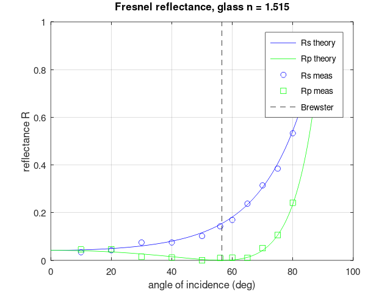
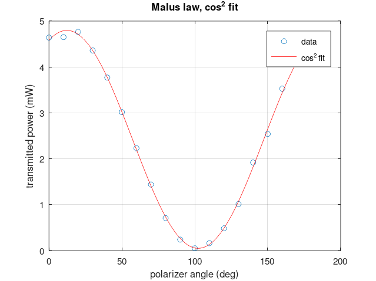

# optics lab, fall 2022

my working folder for the upper-div optics lab. matlab in the lab, **octave** at home, and some python on the side. messy on purpose, this is wa summary of the coursework content I did.

HeNe on an optical table, a different experiment most weeks. analysis lives in `matlab/`, raw-ish data in `data/`, output plots in `figures/`, and my lab notes in `notes/`.

> note: most of this was run in **octave** at home (a free matlab clone) when the lab
> license wasn't handy. same `.m` files, so the figures here are octave output.

## the labs
1. laser alignment + HeNe characterization
2. intro to matlab for data analysis
3. gaussian beams (knife edge, waist, Rayleigh range)
4. michelson interferometer (build it, measure lambda)
5. michelson II (piezo calibration)
6. reflectance (brewster angle, fresnel equations)
7. lenses + imaging I (focal length)
8. lenses + imaging II (telescopes, microscopes)
9. polarization (malus, wave plates), also the final-project kickoff
10. interference + diffraction (single/double slit)
11. SLM wavefront modulation (laguerre-gauss / vortex beams)

final project: generating + measuring polarization states with wave plates (see `notes/final-project.md`).

## a couple results
brewster angle, p-pol reflectance dropping to zero right where the fresnel equations say:

malus law, clean cos^2:

## Note
- a little is in `python/` as well
- not every week has a writeup, some weeks are just a quick note in `notes/`
- raw camera/spectrometer dumps are gitignored (too big), only the reduced csv is here
- error bars are on my eternal todo list (`notes/todo.md`), been there since week 3 
